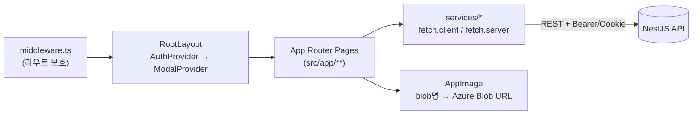
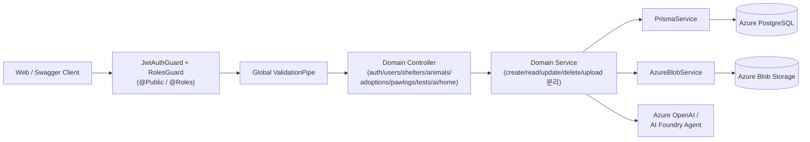
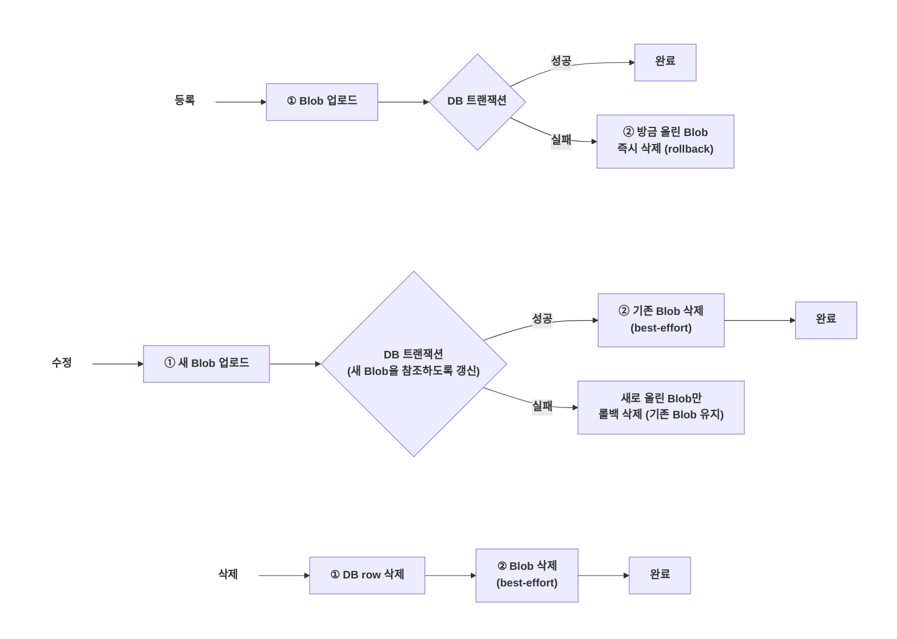
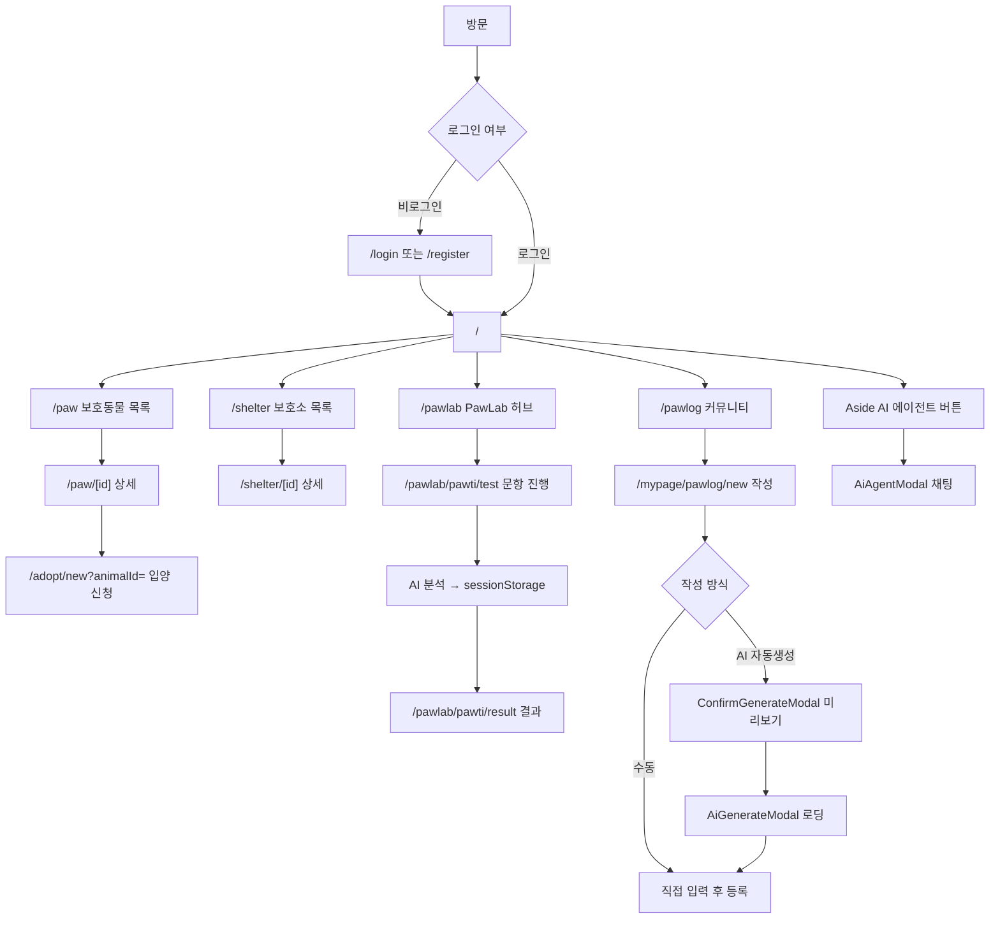
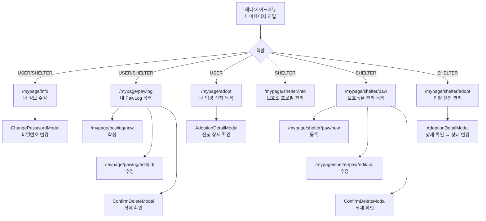
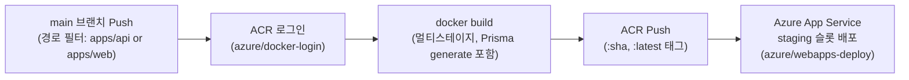

# 🐾 PawConnect

**사람과 보호동물을 연결하는 입양 플랫폼**

> 보호동물 입양 · 성향 테스트 기반 맞춤 추천 · AI 커뮤니티를 통합 제공하는 웹 서비스

[](./LICENSE)
[](#)
[](#)
[](#)
[](#)
[](#)

<br/><br/>

## 목차

- [프로젝트 개요](#프로젝트-개요)
- [기술 스택](#기술-스택)
- [주요 기능](#주요-기능)
- [폴더 구조](#폴더-구조)
- [페이지 / 모달 구성](#페이지--모달-구성)
- [API 라우터](#api-라우터)
- [아키텍처](#아키텍처)
- [유저 플로우](#유저-플로우-페이지-흐름)
- [배포 방식 (CI/CD)](#배포-방식-github-actions--docker--azure)
- [버전 히스토리](#버전-히스토리)
- [팀 & 기획 문서](#팀--기획-문서)
- [License](#license)

<br/><br/>

## 프로젝트 개요

**PawConnect**는 보호동물 보호소와 입양 희망자를 연결하는 웹 플랫폼입니다. 사용자는 보호 중인 동물 정보를 확인하고 입양을 신청할 수 있고, 보호소는 보호동물과 입양 신청자를 온라인으로 관리할 수 있습니다. 여기에 성향 테스트 기반 보호동물 추천, AI 자동 글쓰기, AI 에이전트 챗봇 등 차별화 기능을 더해 입양에 대한 관심과 참여를 유도하는 것을 목표로 합니다.

**프로젝트 목표**

- 보호동물 입양 정보 접근성 향상
- 보호소와 입양 희망자 간 연결 지원 및 입양 프로세스의 온라인화
- 성향 기반 추천(PawTI)을 통한 입양 관심도 증가
- AI 기반 콘텐츠 생성/상담으로 사용자 참여 활성화

> 2인 팀(팀 연홍 · TEAM YH)이 약 4주간 기획→개발→배포까지 진행한 프로젝트입니다. 자세한 기획 배경은 [팀 & 기획 문서](#팀--기획-문서)를 참고하세요.

<br/><br/>

## 기술 스택

### Frontend (`apps/web`)

| 구분 | 내용 |
| --- | --- |
| 프레임워크 | Next.js 16 (App Router), React 19, TypeScript |
| 스타일링 | CSS Module |
| 상태관리 | React Context API (`AuthProvider`, `ModalProvider`) — 별도 상태관리 라이브러리 미사용 |
| 폼 처리 | React 19 Server Actions (`useActionState`) |
| 배포 산출물 | Next.js `standalone` 빌드 (Docker 전용) |

### Backend (`apps/api`)

| 구분 | 내용 |
| --- | --- |
| 프레임워크 | NestJS 11 (Express 플랫폼), TypeScript |
| ORM / DB | Prisma 6 → PostgreSQL (Azure Database for PostgreSQL) |
| 인증 | JWT (`@nestjs/jwt`, `passport-jwt`) + `bcrypt` |
| 검증 | `class-validator` / `class-transformer`, `Joi`(환경변수 검증) |
| 파일 업로드 | `multer` (메모리 스토리지) → Azure Blob Storage |
| API 문서 | Swagger (`@nestjs/swagger`, `/api` 경로) |
| AI 연동 | Azure OpenAI(`openai` SDK), Azure AI Foundry Agent(`@azure/ai-projects`, `@azure/identity`) |

### 인프라 / 공통

| 구분 | 내용 |
| --- | --- |
| Azure | Database for PostgreSQL, Blob Storage, OpenAI/AI Foundry, Container Registry(ACR), App Service |
| CI/CD | GitHub Actions → Docker(멀티스테이지) → Azure App Service |
| 모노레포 | pnpm workspace(`pnpm@9.0.0`) + Turborepo — `apps/api`(백엔드), `apps/web`(프론트엔드)로 구성 |

<br/><br/>

## 주요 기능

| 기능 | 설명 |
| --- | --- |
| 회원 시스템 | 역할 기반 회원가입(일반 사용자 / 보호소 관리자), JWT 로그인·로그아웃, 마이페이지(정보 수정·비밀번호 변경) |
| 보호동물 게시판 | 등록/조회/수정/삭제, 품종·성별·나이·상태별 필터링과 페이지네이션, 상태 관리(보호중/입양가능/입양완료/복귀/사망/안락사 등) |
| 입양 신청 프로세스 | 신청서 작성 → 다단계 상태 진행(대기 → 상담 → 면접 → … → 승인/거절/취소), 사용자·보호소 양측 신청 내역 조회 |
| 보호소 페이지 | 보호소 소개(위치, 연락처, 운영시간), 등록 동물 목록, 보호소 프로필 관리 |
| PawLog 커뮤니티 | 반려동물 자랑 게시판(작성/수정/삭제, 이미지 최대 4장), AI 자동 글쓰기(이미지 기반 제목·본문 자동 생성) |
| PawLab · PawTI 성향 테스트 | "나는 어떤 견종이었을까?" — 문항 응답 → AI 분석 → 맞춤 보호동물 추천 및 결과 해설 |
| AI 에이전트 챗봇 | 전역 플로팅 버튼으로 언제든 열 수 있는 채팅 상담(동물/보호소 카드 인라인 응답) |

<br/><br/>

## 폴더 구조

```
PawConnect/                     # git 저장소 루트
├── .github/workflows/          # CI/CD (deploy-api.yml, deploy-web.yml)
├── documents/                  # 기획 문서 (기획서, 요구사항, 와이어프레임, API/DB 명세, 링크 등)
├── LICENSE
└── pawconnect/                 # pnpm + Turborepo 모노레포
    └── apps/
        ├── web/                # Next.js 16 프론트엔드
        │   ├── src/app/        # App Router 페이지
        │   ├── src/components/ # 도메인별 컴포넌트 + 공용 모달
        │   ├── src/services/   # 도메인별 API 클라이언트 (client/server 분리)
        │   └── src/providers/  # AuthProvider, ModalProvider
        └── api/                # NestJS 11 백엔드
            ├── src/            # auth/users/shelters/animals/adoptions/pawlogs/tests/ai/azure/prisma 등 도메인 모듈
            └── prisma/         # schema.prisma, migrations/
```

<br/><br/>

## 페이지 / 모달 구성

### 페이지 라우트 (`apps/web/src/app`)

| 라우트 | 설명 |
| --- | --- |
| `/` | 홈 — 배너 슬라이더, 최신 보호동물, 신규 보호소 |
| `/login` | 로그인 |
| `/register` | 역할(개인/보호소) 선택 후 회원가입 |
| `/paw` | 보호동물 목록(필터 + 페이지네이션) |
| `/paw/[id]` | 보호동물 상세 |
| `/adopt/new?animalId=` | 입양 신청서 작성 |
| `/pawlog` | PawLog 커뮤니티 피드 |
| `/pawlog/[id]` | PawLog 게시글 상세(이전/다음 이동) |
| `/pawlab` | PawLab 허브(테스트 카탈로그) |
| `/pawlab/pawti/test` | PawTI 성향 테스트 문항 진행 |
| `/pawlab/pawti/result` | PawTI 결과(세션 스토리지 기반) |
| `/shelter` | 보호소 목록 |
| `/shelter/[id]` | 보호소 상세 |
| `/mypage/info` | 내 정보 수정 |
| `/mypage/adopt` | 내 입양 신청 목록 (일반 사용자) |
| `/mypage/pawlog`, `/new`, `/edit/[id]` | 내 PawLog 작성/수정/목록 |
| `/mypage/shelter/info` | 보호소 프로필 관리 (보호소 관리자) |
| `/mypage/shelter/paw`, `/new`, `/edit/[id]` | 보호소 동물 등록/수정/관리 |
| `/mypage/shelter/adopt` | 보호소로 들어온 입양 신청 관리 |

라우트 보호는 `src/middleware.ts`가 담당합니다: 로그인 사용자는 `/login`·`/register` 접근 시 홈으로, 비로그인 사용자는 `/mypage/*` 접근 시 `/login`으로 리다이렉트합니다.

### 모달 구성 (`apps/web/src/components/modal`)

모든 모달은 `ModalProvider`의 `ModalKey` 유니온으로 등록되고 `ModalRoot`에서 한 번만 마운트되며, `openModal(key, params)`로 어디서든 열 수 있습니다.

| 모달 | 용도 |
| --- | --- |
| `LoginRequiredModal` | 비로그인 사용자가 보호된 액션 시도 시 로그인 유도 |
| `ConfirmLogoutModal` | 로그아웃 확인 |
| `ConfirmDeleteModal` | 범용 삭제 확인(동물/게시글 등) |
| `ImageViewerModal` | 이미지 라이트박스 뷰어 |
| `ContentViewerModal` | 읽기 전용 텍스트 뷰어(이용약관, 개인정보 처리방침 등) |
| `ChangePasswordModal` | 비밀번호 변경 |
| `AdoptionDetailModal` | 입양 신청 상세 조회 |
| `ConfirmGenerateModal` | AI 생성 콘텐츠 미리보기 확인 |
| `AiGenerateModal` | AI 콘텐츠 생성 대기 로딩 |
| `AiAgentModal` | AI 챗봇 전체 대화 UI |

<br/><br/>

## API 라우터

`apps/api` 기준 전체 엔드포인트입니다. 상세 스펙은 서버 실행 후 `/api`(Swagger)에서 확인할 수 있습니다.

| Method | Path | 설명 | 인증/권한 |
| --- | --- | --- | --- |
| GET | `/` | 헬스체크 | Public |
| POST | `/auth/register/user` | 일반 사용자 회원가입 | Public |
| POST | `/auth/register/shelter` | 보호소 관리자 회원가입 | Public |
| POST | `/auth/login` | 로그인 (JWT 발급) | Public |
| POST | `/auth/logout` | 로그아웃 | JWT |
| GET | `/users/me` | 내 정보 조회 | JWT |
| PATCH | `/users/me` | 내 정보 수정 | JWT |
| PATCH | `/users/password` | 비밀번호 변경 | JWT |
| GET | `/shelters/me` | 내 보호소 정보 조회 | JWT, SHELTER |
| PATCH | `/shelters/me` | 내 보호소 정보 수정 | JWT, SHELTER |
| GET | `/shelters/me/adoptions` | 내 보호소 입양 신청 목록 | JWT, SHELTER |
| GET | `/shelters/me/animals` | 내 보호소 동물 목록 | JWT, SHELTER |
| GET | `/shelters` | 보호소 목록 | Public |
| GET | `/shelters/:name` | 보호소 상세 | Public |
| POST | `/animals` | 보호동물 등록 | JWT, SHELTER |
| GET | `/animals` | 보호동물 목록(필터) | Public |
| GET | `/animals/:id` | 보호동물 상세 | Public |
| PATCH | `/animals/:id` | 보호동물 수정 | JWT, SHELTER |
| DELETE | `/animals/:id` | 보호동물 삭제 | JWT, SHELTER |
| PATCH | `/animals/:id/status` | 보호동물 상태 변경 | JWT, SHELTER |
| POST | `/adoptions` | 입양 신청 등록 | JWT, USER |
| GET | `/adoptions/me` | 내 입양 신청 목록 | JWT, USER |
| GET | `/adoptions/:id` | 입양 신청 상세 | JWT |
| PATCH | `/adoptions/:id/status` | 입양 신청 상태 변경 | JWT, USER/SHELTER |
| GET | `/pawlogs` | PawLog 목록 | Public |
| GET | `/pawlogs/me` | 내 PawLog 목록 | JWT, USER/SHELTER |
| POST | `/pawlogs` | PawLog 작성 (이미지 최대 4장) | JWT, USER/SHELTER |
| GET | `/pawlogs/:id` | PawLog 상세 | Public |
| PATCH | `/pawlogs/:id` | PawLog 수정 | JWT, USER/SHELTER |
| DELETE | `/pawlogs/:id` | PawLog 삭제 | JWT, USER/SHELTER |
| POST | `/tests/personality` | PawTI 성향 테스트 결과 생성 | Public |
| POST | `/ai/pawlab/pawti/analysis` | PawTI AI 분석 요청 | Public |
| POST | `/ai/pawlogs/generate` | AI PawLog 자동 생성 | JWT, USER/SHELTER |
| POST | `/ai/animals/generate` | AI 품종 추론 + 등록용 게시글 자동 생성 | JWT, SHELTER |
| POST | `/ai/agent` | AI 에이전트 채팅 | Public |
| GET | `/home` | 홈 화면 데이터 | Public |

<br/><br/>

## 아키텍처

### Web (`apps/web`)



| 구분 | 내용 |
| --- | --- |
| App Router 구조 | `src/app` 하위에 `page.tsx`/`layout.tsx` 규칙으로 라우팅. `route.ts` API 핸들러는 없으며, 순수하게 별도 NestJS API를 호출하는 클라이언트 앱입니다. |
| 라우트 보호 | `src/middleware.ts`에서 `checkAccessToken()`으로 인증 상태를 확인해 로그인/회원가입·마이페이지 접근을 제어합니다. |
| 상태관리 | 전역은 Context API 2종(`AuthProvider`, `ModalProvider`)만 사용, 로컬 상태는 `useState`/커스텀 훅(`useImageUploader`, `usePawLogForm` 등)으로 처리합니다. |
| API 통신 | `src/services/fetch/`에서 브라우저용(`fetch.client.ts`, 쿠키 기반 인증)과 서버 컴포넌트/액션용(`fetch.server.ts`, 명시적 토큰)을 분리하고, 공통 `ApiError`로 검증 에러를 폼 필드에 매핑합니다. 401 응답 시 `auth:expired` 이벤트로 전역 강제 로그아웃을 트리거합니다. |
| 폼 처리 | React 19 Server Actions(`useActionState`)를 로그인/비밀번호변경/게시글 작성 등 대부분의 폼에 사용합니다. |
| 이미지 표시 | `AppImage` 컴포넌트가 백엔드에서 받은 blob 이름을 `NEXT_PUBLIC_AZURE_STORAGE_DOMAIN`/`NEXT_PUBLIC_AZURE_PUBLIC_CONTAINER` 조합으로 실제 Azure Blob URL로 변환합니다. 프론트엔드는 Azure SDK를 직접 사용하지 않습니다. |

### API (`apps/api`)



| 구분 | 내용 |
| --- | --- |
| 레이어드 + 모듈 아키텍처 | 도메인별 NestJS 모듈(`auth`, `users`, `shelters`, `animals`, `adoptions`, `pawlogs`, `tests`, `ai`, `home`)과 공통 인프라 모듈(`prisma`, `azure`, `config`, `common`)로 구성. 각 도메인은 기능별 서비스 파일(`*-create.service.ts`, `*-query.service.ts`, `*-update.service.ts`, `*-upload.service.ts` 등)로 세분화되어 있습니다. |
| 인증/인가 | `passport-jwt` 전략(Bearer 헤더 또는 쿠키 모두 지원) 기반 JWT + `RolesGuard`의 `@Roles(Role.XXX)` RBAC. 클래스 레벨 `@UseGuards(JwtAuthGuard, RolesGuard)`를 기본으로 걸고 개별 라우트는 `@Public()`으로 예외 처리합니다. |
| 공통 처리 | 글로벌 `ValidationPipe`(class-validator, whitelist+transform), `HttpExceptionFilter`(통일된 에러 응답 포맷), `Joi` 기반 환경변수 검증(`ConfigModule`). |
| AzureModule | `@Global()` 모듈로 등록되어 어디서든 `AzureBlobService`를 주입받아 이미지 업로드/삭제/교체를 처리합니다. |
| AI 모듈 | Azure OpenAI(게시글 자동 생성, 품종 추론)와 Azure AI Foundry Agent(성향 분석, 챗봇)를 함께 활용하며, `register-agent-tools.ts` 스크립트로 에이전트 함수 도구를 별도 등록합니다. |
| 실시간 통신 없음 | WebSocket/Socket.io는 사용하지 않으며 AI 챗봇도 REST 방식입니다. |

### DB & 이미지 저장 방식

#### DB — Azure Database for PostgreSQL + Prisma

| 구분 | 내용 |
| --- | --- |
| 연결 | `apps/api`의 `DATABASE_URL` 환경변수가 Azure Database for PostgreSQL 인스턴스를 직접 가리킵니다. Prisma Client(`@prisma/client`)가 `PrismaService`(전역 `PrismaModule`)를 통해 주입됩니다. |
| 트랜잭션 안전성 | 이미지 업로드가 포함된 등록/수정(회원가입, 동물 등록, PawLog 작성 등)은 `prisma.$transaction`으로 처리하고, DB 저장 실패 시 이미 업로드된 Azure Blob을 롤백(삭제)하는 패턴을 여러 서비스에서 공통 적용합니다. |

**주요 모델**

| 모델 | 설명 |
| --- | --- |
| `User` | Role: USER/SHELTER/ADMIN, UserStatus — `Shelter`, `Adoption`, `PawLog`, `UserAgreement`와 연관 |
| `Shelter` + `ShelterImage`(1:N) | `Animal`(1:N), 소속 `User`(1:N) |
| `AnimalSpecies` / `AnimalBreed`(마스터) → `Animal` + `AnimalDetail`(1:1) + `AnimalImage`(1:N) | AnimalStatus: 보호중/입양가능/입양완료/복귀/사망/안락사 등 |
| `Adoption` + `AdoptionDetail`(1:1) + `AdoptionAgreement`(1:N) | 입양 신청서 상세, AdoptionStatus: 대기 → 상담 → 면접 → … → 승인/거절/취소 |
| `Agreement` / `UserAgreement` / `AdoptionAgreement` | 약관 동의 마스터/이력 구조 |
| `PawLog` + `PawLogImage`(1:N) | 반려동물 자랑 게시글 |

#### 이미지 — Azure Blob Storage

| 구분 | 내용 |
| --- | --- |
| 업로드 흐름 | 클라이언트가 `FormData`로 파일을 API에 전송 → `multer`(메모리 스토리지)로 수신 → 도메인별 `*-upload.service.ts`가 `AzureBlobService`(`apps/api/src/azure/azure-blob`)를 호출해 UUID 파일명으로 `폴더/uuid.ext` 형태로 퍼블릭 컨테이너에 업로드. |
| 주요 메서드 | `uploadPublic` / `uploadPublicMultiple`(다중 업로드, 일부 실패 허용) / `deleteBlob` / `replacePublic`(신규 업로드 성공 후 기존 파일 교체). |
| 제약 | jpeg/png/gif/webp만 허용, 파일당 최대 5MB, 용도별 폴더 구분(프로필, 보호소 배너/이미지, 동물 썸네일/이미지, PawLog 이미지 등). |
| 프론트 표시 | 프론트엔드는 Azure SDK를 사용하지 않고, API가 반환한 blob 이름을 `AppImage` 컴포넌트가 `NEXT_PUBLIC_AZURE_STORAGE_DOMAIN` + `NEXT_PUBLIC_AZURE_PUBLIC_CONTAINER`와 조합해 URL을 만들어 렌더링합니다. |

##### 고아 파일(Orphan File) 방지 정책

"DB가 참조하는 Blob은 항상 실제로 존재해야 한다"는 원칙을 우선시하며, 등록/수정/삭제 각 시나리오마다 아래처럼 Blob 작업과 DB 작업의 순서를 다르게 가져가 고아 파일(참조 없이 스토리지에만 남는 이미지)과 깨진 참조(DB는 있는데 Blob이 없는 상태) 둘 다를 최소화합니다.



| 시나리오 | 처리 방식 |
| --- | --- |
| 등록 | `AzureBlobService.uploadPublic`/`uploadPublicMultiple`으로 Blob을 먼저 올린 뒤 그 blob 이름으로 `prisma.$transaction`을 실행합니다(예: `animals-create.service.ts`). 트랜잭션이 실패하면 catch 블록에서 방금 올린 Blob들을 즉시 삭제(`rollback()`)해, DB에 전혀 참조되지 않는 고아 파일이 남지 않도록 합니다. |
| 수정 | 새 이미지가 있으면 새 Blob을 먼저 업로드하고, 트랜잭션으로 DB 레코드가 새 Blob을 가리키도록 갱신한 뒤에야 기존 Blob을 삭제합니다(delete-after-commit, `animals-update.service.ts`). 트랜잭션이 실패하면 새로 올린 Blob만 롤백 삭제하고 기존 Blob은 손대지 않아, DB는 항상 실제로 존재하는 파일만 가리키게 됩니다. 커밋 이후의 기존 Blob 삭제가 실패해도 트랜잭션 자체는 이미 성공했으므로 예외를 던지지 않고 경고 로그만 남깁니다 — 깨진 DB 참조보다 지워지지 않은 고아 Blob 한 장을 허용하는 쪽을 선택한 정책입니다. |
| 삭제 | DB row를 먼저 삭제한 뒤 Blob을 삭제합니다. Blob 삭제가 실패해도 warn 로그만 남기고 넘어가, DB 무결성(참조 없는 레코드가 남지 않는 것)을 이미지 정리보다 우선합니다. |
| 다중 업로드 내성 | `uploadPublicMultiple`은 `Promise.allSettled`로 일부 파일 업로드 실패를 허용하고 성공한 파일만 결과에 포함시켜, 한 장의 실패가 전체 등록/수정을 막지 않도록 합니다. |

<br/><br/>

## 유저 플로우 (페이지 흐름)

양이 많아 **핵심 서비스 흐름**과 **마이페이지 흐름** 두 부분으로 나누어 정리합니다.

### 핵심 서비스 흐름



- **로그아웃**: 헤더/사이드메뉴 → `ConfirmLogoutModal` 확인 → `AuthContext.logout()` → `/login` 리다이렉트.
- **비로그인 보호 액션**: 글쓰기 등 인증 필요 액션 클릭 시 `LoginRequiredModal`이 우선 노출됩니다.

### 마이페이지 흐름

`SideMenu`는 로그인한 사용자의 역할(USER / SHELTER)에 따라 다른 메뉴를 보여줍니다.



- 비로그인 사용자가 `/mypage/*`에 접근하면 `middleware.ts`가 `/login`으로 리다이렉트합니다.
- 삭제(PawLog, 보호동물)는 공통 `ConfirmDeleteModal`을 거쳐 확정되며, 입양 신청 확인은 사용자·보호소 양쪽 모두 동일한 `AdoptionDetailModal`을 재사용합니다.

<br/><br/>

## 배포 방식 (GitHub Actions → Docker → Azure)



| 구분 | 내용 |
| --- | --- |
| 트리거 | `.github/workflows/deploy-api.yml`, `deploy-web.yml`이 각각 `pawconnect/apps/api/**` / `pawconnect/apps/web/**`(+공통 워크스페이스 파일) 경로 변경 시 `main` 브랜치 push로 트리거되며, 수동 실행(`workflow_dispatch`)도 지원합니다. |
| Docker 빌드 — API | `apps/api/Dockerfile`, `node:20-alpine` 기반 멀티스테이지(`deps → build → production`). pnpm 워크스페이스 전체를 설치한 뒤 더미 `DATABASE_URL`로 `prisma generate` 실행 → NestJS 빌드 → 프로덕션 스테이지에서 `node apps/api/dist/src/main.js` 실행(포트 3001). |
| Docker 빌드 — Web | `apps/web/Dockerfile`, `node:20-alpine` 기반 멀티스테이지. `NEXT_PUBLIC_*` 값들을 빌드 인자로 주입해 Next.js `standalone` 빌드 → `node apps/web/server.js` 실행(포트 3000). |
| 레지스트리/배포 | 빌드된 이미지를 Azure Container Registry(ACR)에 `:{git-sha}` 및 `:latest` 태그로 push한 뒤, Azure App Service의 staging 슬롯(`pawconnect-api`, `pawconnect-web`)에 배포합니다. |
| 필요 GitHub Secrets | (값은 저장소 Settings에만 존재) `ACR_LOGIN_SERVER`, `ACR_USERNAME`, `ACR_PASSWORD`, `AZURE_WEBAPP_PUBLISH_PROFILE_API_STAGING`, `AZURE_WEBAPP_PUBLISH_PROFILE_WEB_STAGING`, `NEXT_PUBLIC_API_URL`, `NEXT_PUBLIC_AZURE_STORAGE_DOMAIN`, `NEXT_PUBLIC_AZURE_PUBLIC_CONTAINER`. |
| IaC | Bicep/ARM, `docker-compose.yml` 등은 별도로 두지 않고, Azure 리소스 배포는 GitHub Actions 워크플로우에서 직접 ACR/App Service를 호출하는 방식입니다. |

<br/><br/>

## 버전 히스토리

| 버전 | 날짜 | 내용 |
| --- | --- | --- |
| `v1.0.0` | 2026-08-12 | 첫 정식 릴리즈 태그. CI/CD(GitHub Actions → Docker → Azure) 파이프라인 안정화 시점에 생성 (커밋 `12ac37f`) |

- 브랜치 전략: `main`(배포) / `develop`(통합) / `feature/*`, `refactor/*`(기능 단위) — PR 기반 워크플로우(`Merge pull request #N`)
- 총 355개 이상의 커밋, 40개 이상의 PR 병합 이력 (2026-07 초 ~ 진행 중)

<br/><br/>

## 팀 & 기획 문서

2인 팀(팀 연홍 · TEAM YH)이 담당 기능의 프론트엔드·백엔드를 모두 구현하는 방식으로 진행했습니다.

| 팀원 | 담당 기능 |
| --- | --- |
| 조가연 | 기획 총괄, 회원 시스템(가입/로그인/권한/마이페이지), 보호소 관리, 반려동물 일상 게시판(PawLog CRUD), Azure·Git 관리 |
| 홍아림 | 디자인 기획, 보호동물(CRUD/검색/필터), 입양 프로세스, 성향 테스트(PawTI, AI 기능) |

상세 기획·설계 문서는 [`documents/`](./documents) 폴더에 있습니다.

- [01. 서비스 기획(MVP)](./documents/01_service_planning.md)
- [02. 마일스톤 & 역할분담](./documents/02_milestones_and_roles.md)
- [03. 요구사항 명세서](./documents/03_requirements_spec.md)
- [04. 와이어프레임/스토리보드](./documents/04_wireframe_storyboard.md)
- [05. 기능 정의서](./documents/05_functional_spec.md)
- [06. 고객 요구사항](./documents/06_customer_requirements.md)
- [07. API 명세서](./documents/07_api_spec.md)
- [08. DB ERD](./documents/08_DB_ERD.md)
- [09. 외부 링크](./documents/09_links.md) — Figma, ERD Cloud, 스토리보드, 발표 자료

<br/><br/>

## License

이 프로젝트는 [MIT License](./LICENSE)를 따릅니다.

Copyright (c) 2026 팀 연홍 (TEAM YH)
